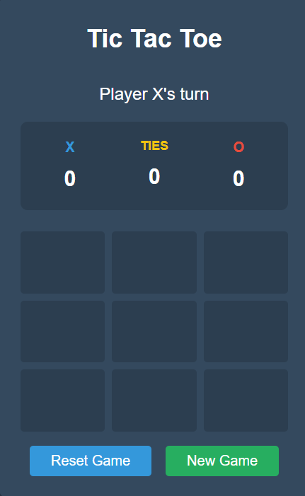

# 🎮 Tic-Tac-Toe React App

Welcome to the **Tic-Tac-Toe** game built with React! ⚛️🔥

## 🚀 Features
- 🎲 **Classic Tic-Tac-Toe Gameplay**: Play against a friend in the classic 3x3 grid.
- 🎨 **Modern UI**: A sleek and responsive design.
- ⚡ **Fast & Interactive**: Built with React for smooth performance.
- 🔄 **Reset Game**: Start a new game anytime with a click.
- 🎯 **Winning Detection**: Automatically detects the winner or a draw.

## 🛠️ Installation

1. **Clone the repository** 📂
   ```bash
   git clone https://github.com/your-Aym-Aymen777/tictactoe-react.git
   cd tictactoe-react
   ```
2. **Install dependencies** 📦
   ```bash
   npm install
   ```
3. **Start the development server** 🚀
   ```bash
   npm start
   ```

## 📸 Preview



## 🏗️ Technologies Used
- ⚛️ React.js
- 🎨 CSS (or TailwindCSS)
- 📜 JavaScript (ES6+)

## 🤝 Contributing
Feel free to fork this repository and make improvements! 🚀

## 📜 License
This project is licensed under the **MIT License**. 📝

---
_Enjoy the game! 🕹️🎉_

